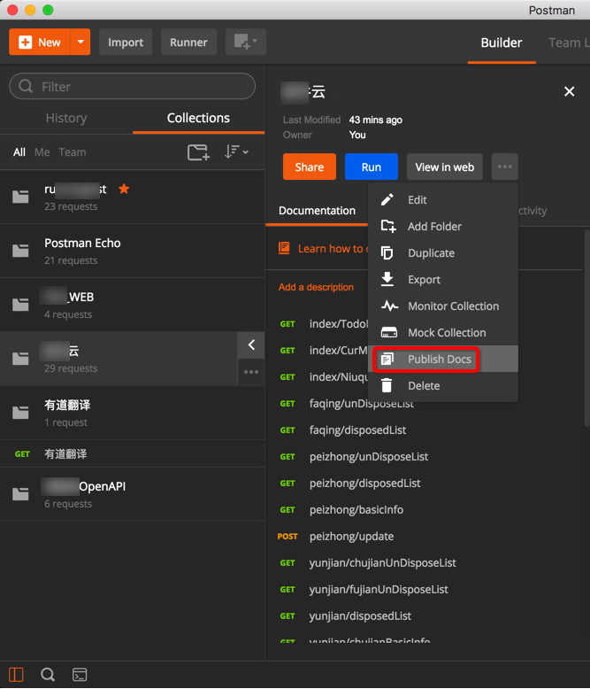
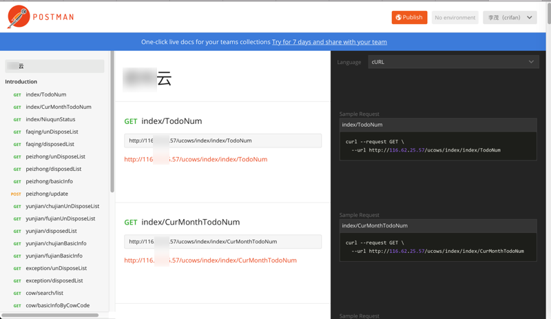
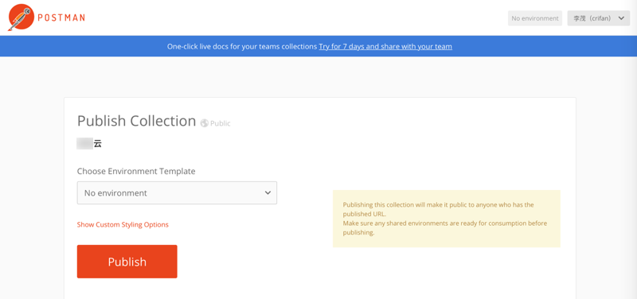

# 预览和发布API文档
下面介绍Postman中如何预览和发布API文档。

## 简要概述步骤
1. Collection
2. 鼠标移动到某个Collection，点击 三个点
3. Publish Docs
4. Publish
5. 得到Public URL
6. 别人打开这个Public URL，即可查看API文档

## 详细解释具体操作

## 预览API文档
点击分组右边的大于号**>**

如果只是预览，比如后台开发员自己查看API文档的话，可以选择：View in web

> 等价于点击**Publish Docs**去发布：
> 
> 

View in Web后，有 Publish的选项（见后面的截图）

View in Web后，会打开预览页面：

比如：

奶牛云

`https://documenter.getpostman.com/collection/view/669382-42273840-6237-dbae-5455-26b16f45e2b9`

而右边的示例代码，也可以从默认的cURL换成其他的：

## 发布API文档

如果想要让其他人能看到这个文档，则点击 Publish：

然后会打开类似于这样的地址：

Postman Documenter

`https://documenter.getpostman.com/collection/publish?meta=Y29sbGVjdGlvbl9pZD00MjI3Mzg0MC02MjM3LWRiYWUtNTQ1NS0yNmIxNmY0NWUyYjkmb3duZXI9NjY5MzgyJmNvbGxlY3Rpb25fbmFtZT0lRTUlQTUlQjYlRTclODklOUIlRTQlQkElOTE=`

点击Publish后，可以生成对应的公开的网页地址：

打开API接口文档地址：

`https://documenter.getpostman.com/view/669382/collection/77fd4RM`

即可看到（和前面预览一样效果的API文档了）：

如此，别人即可查看对应的API接口文档。

## 已发布的API文档支持自动更新

后续如果自己的API接口修改后：

比如：

（后来发现，不用再去进入此预览和发布的流程，去更新文档，而是Postman自动支持）

别人去刷新该文档的页面：

`https://documenter.getpostman.com/view/669382/collection/77fd4RM`

即可看到更新后的内容：

