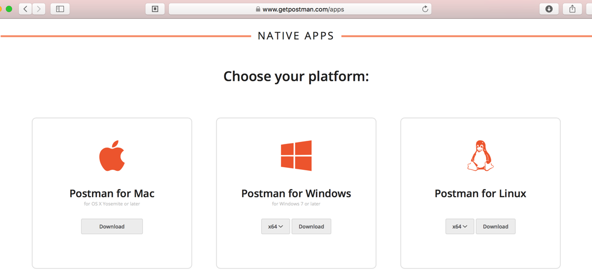

# Postman下载

Postman有两种形式：
* **Chrome App**：Postman for Chrome
  * > 由于Chrome本身快要废弃Chrome App模式了，所以Postman的Chrome App模式也已废弃逐渐不用了
* **app软件**：建议下载（不同平台的）独立的软件去使用

下面主要介绍下载安装独立版本**app软件**的Postman的过程：

去主页[Postman | Supercharge your API workflow](https://www.getpostman.com)找到：[Postman | Apps](https://www.getpostman.com/apps)

去下载自己平台的版本：
* Mac
* Windows（x86/x64）
* Linux（x86/x64）
即可。
