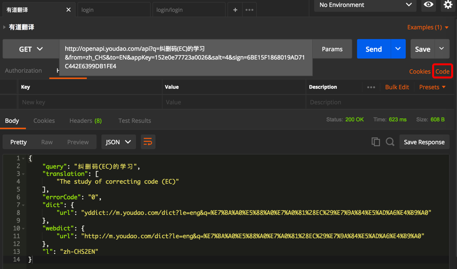
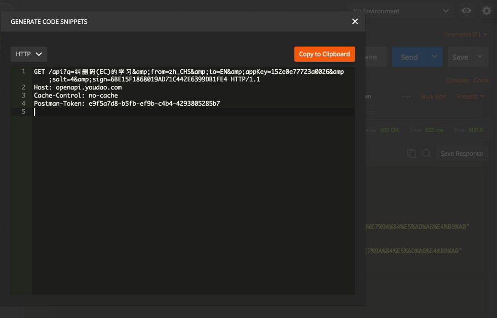
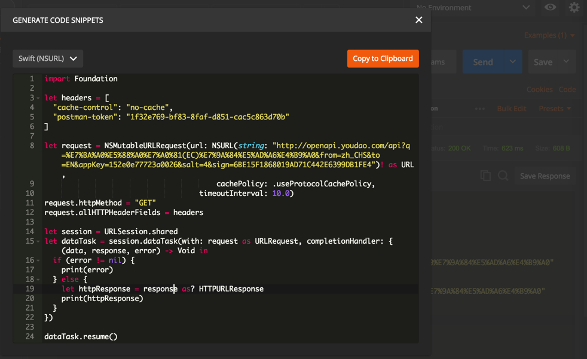
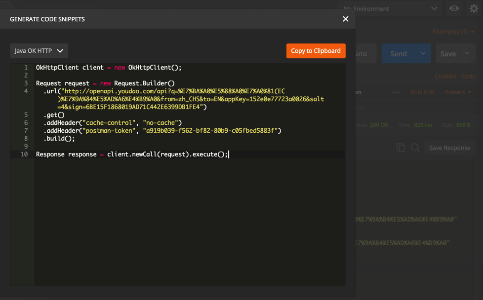
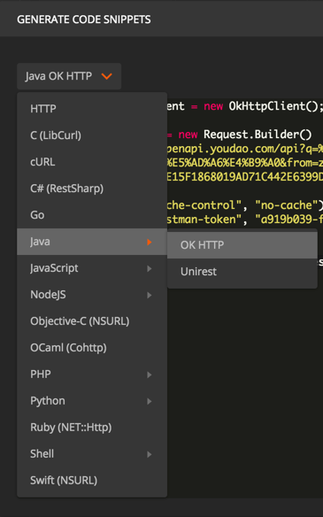

# 代码生成工具

## 查看当前请求的HTTP原始内容

对于当前的请求，还可以通过点击Code

去查看对应的符合HTTP协议的原始的内容：

## 各种语言的示例代码**Code Generation Tools**
比如：

### Swift语言

### Java语言

### 其他各种语言
还支持其他各种语言：

目前支持的语言有：
* HTTP
* C (LibCurl)
* cURL
* C#(RestSharp)
* Go
* Java
  * OK HTTP
  * Unirest
* Javascript
* NodeJS
* Objective-C(NSURL)
* OCaml(Cohttp)
* PHP
* Python
* Ruby(NET::Http)
* Shell
* Swift(NSURL)

代码生成工具的好处是：在写调用此API的代码时，就可以参考对应代码，甚至拷贝粘贴对应代码，即可。