# 用环境变量实现多服务器版本

## 现存问题

在测试API期间，往往存在多种环境，对应IP地址（或域名也不同）

比如：
* **Prod**: `http://116.62.25.57/ucows`
  * 用于开发完成发布到生产环境
* **Dev**: `http://123.206.191.125/ucows`
  * 用于开发期间的线上的Development的测试环境
* **LocalTest**: `http://192.168.0.140:80/ucows`
  * 用于开发期间配合后台开发人员的本地局域网内的本地环境，用于联合调试API接口

而在测试API期间，往往需要手动去修改API的地址：

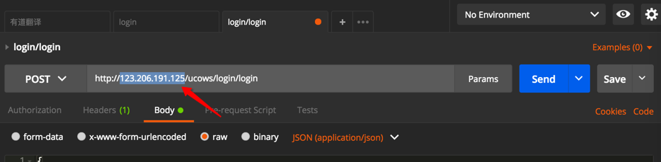

效率比较低，且地址更换后之前地址就没法保留了。

另外，且根据不同IP地址（或者域名）也不容易识别是哪套环境。

## 解决办法
### 小幺鸡的线上环境和本机环境的切换
之前得知[小幺鸡，简单好用的接口文档管理工具](http://www.xiaoyaoji.cn/)
-》[发送JSON-演示项目](http://www.xiaoyaoji.cn/doc/17KoYodbDR)
中有个好用的功能：

支持不同环境：

* 线上环境
* 本地环境

等，当时以为Postman不支持呢

### Postman支持用Environment环境变量去实现多服务器版本

后来发现Postman中，有Environment和Global Variable，用于解决这个问题，实现不同环境的管理：

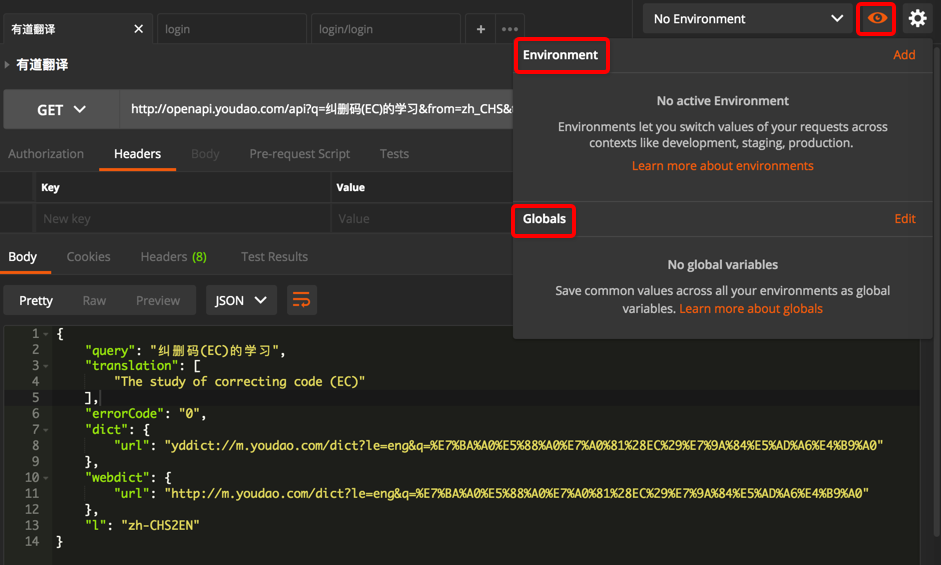

-》很明显，就可以用来实现不用手动修改url中的服务器地址，从而动态的实现，支持不同服务器环境:
* Production生产环境
* Development开发环境
* Local本地局域网环境

#### 如何使用Enviroment实现多服务器版本
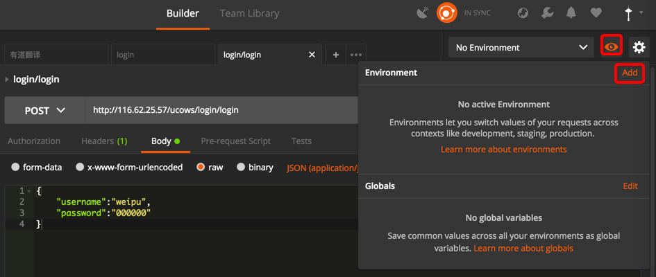

或者：

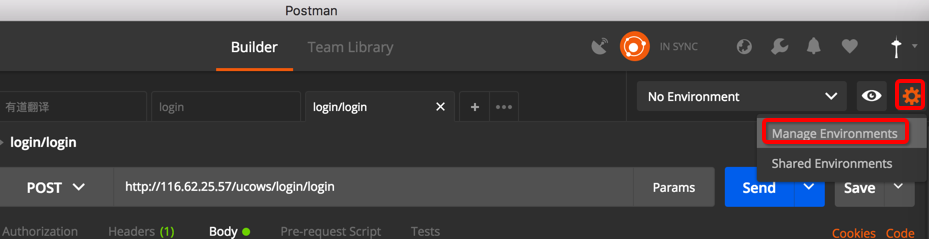

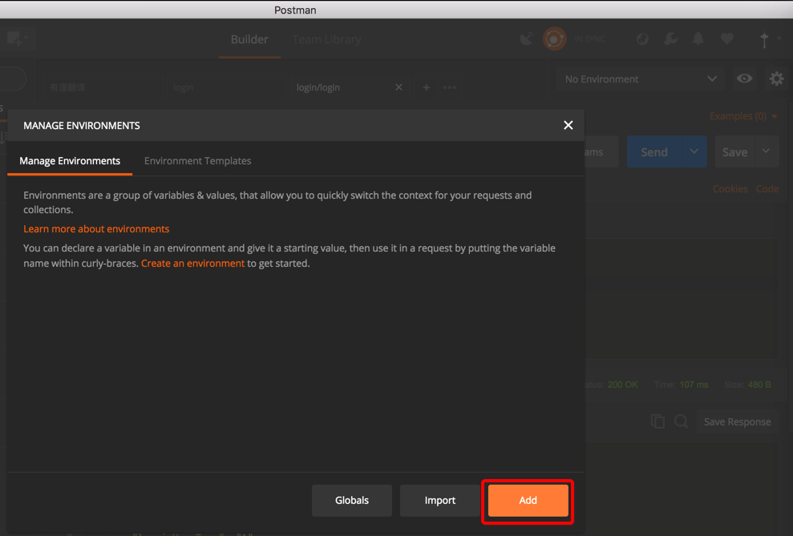

> Environments are a group of variables & values, that allow you to quickly switch the context for your requests and collections.
> 
> Learn more about environments
> 
> You can declare a variable in an environment and give it a starting value, then use it in a request by putting the variable name within curly-braces. Create an environment to get started.

输入Key和value：

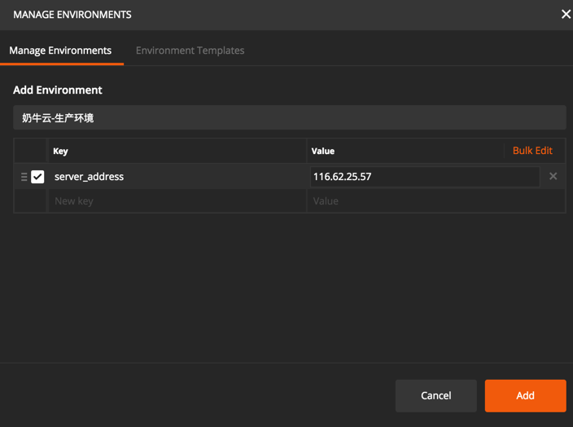

点击Add后：

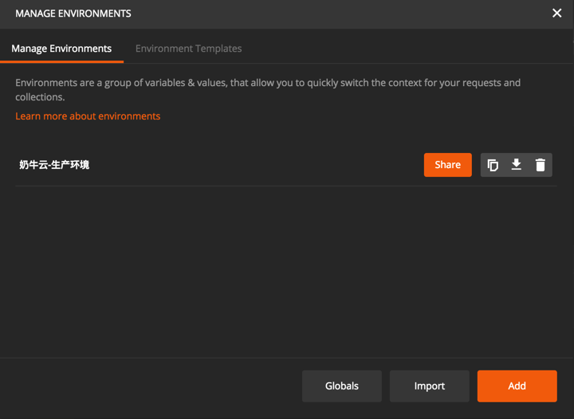

> **[info] 环境变量可以使用的地方**
> * URL
> * URL params
> * Header values
> * form-data/url-encoded values
> * Raw body content
> * Helper fields
> * 写test测试脚本中
>  * 通过postman的接口，获取或设置环境变量的值。

此处把之前的在url中的IP地址（或域名）换成环境变量：

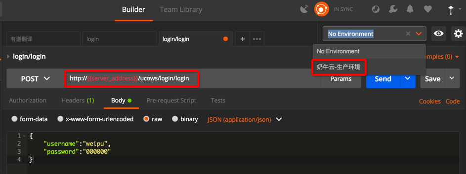

鼠标移动到环境变量上，可以动态显示出具体的值：

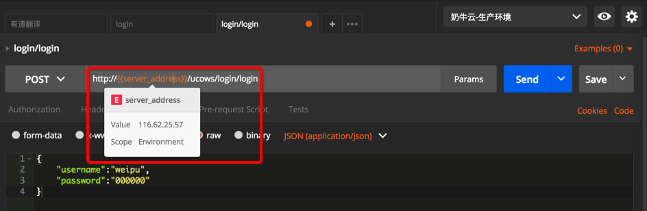

再去添加另外一个开发环境：

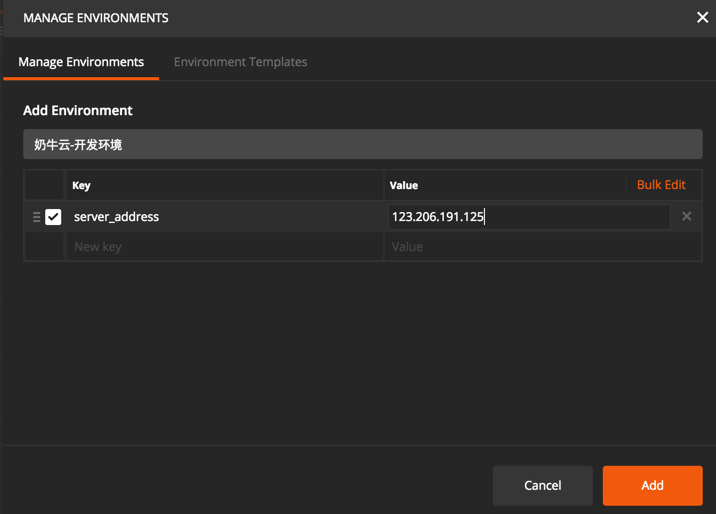

则可添加完2个环境变量，表示两个服务器地址，两个版本：

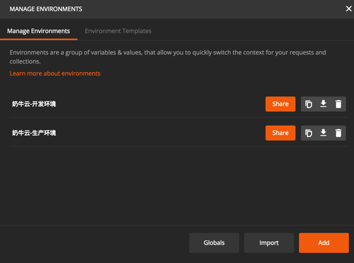

然后就可以切换不同服务器环境了：

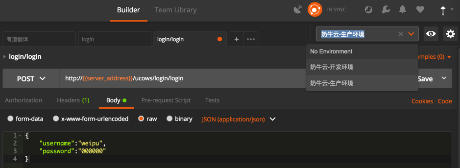

可以看到，同样的变量server_address，在切换后对应IP地址就变成希望的开发环境的IP了：

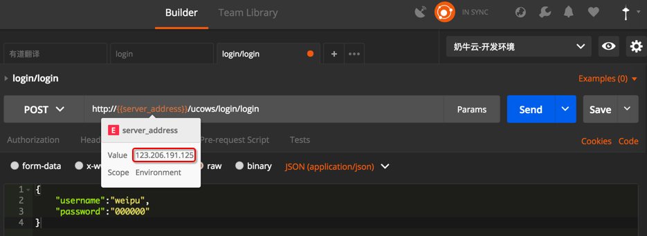

#### Postman导出API文档中多个环境变量的效果

顺带也去看看，导出为API文档后，带了这种Environment的变量的接口，文档长什么样子：

发现是在发布之前，需要选择对应的环境的：

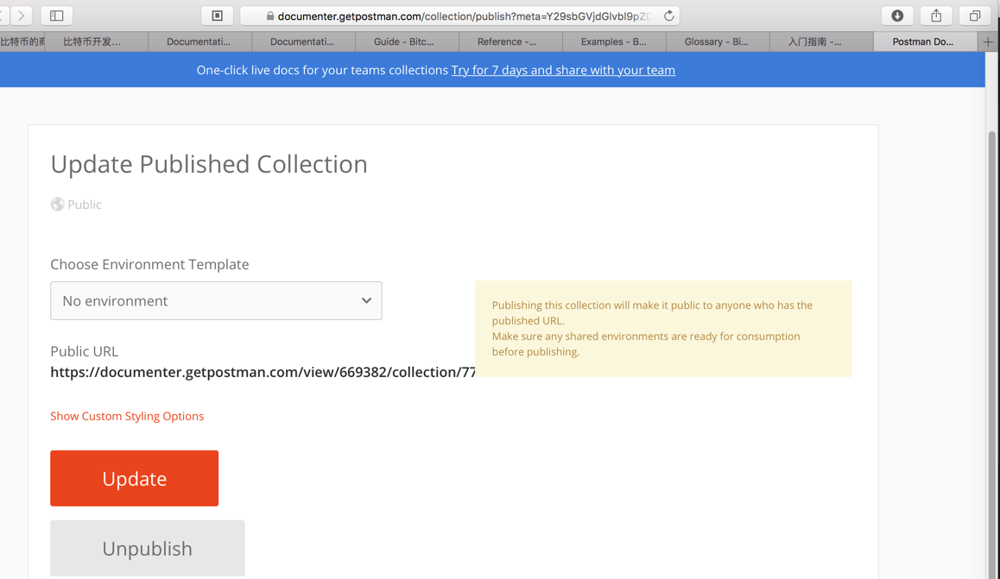

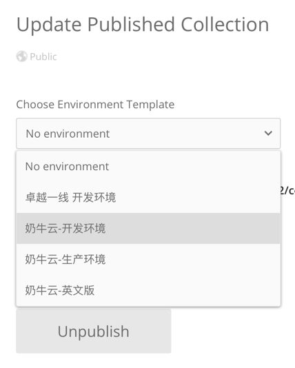

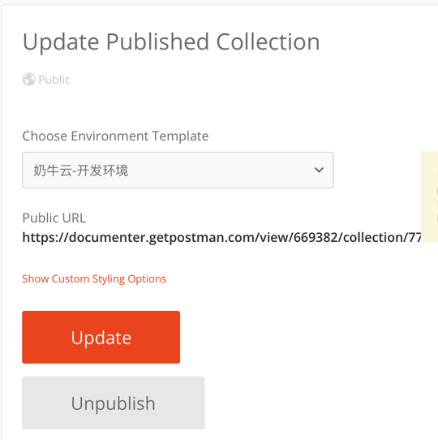

发布后的文档，可以看到所选环境和对应服务器的IP的：

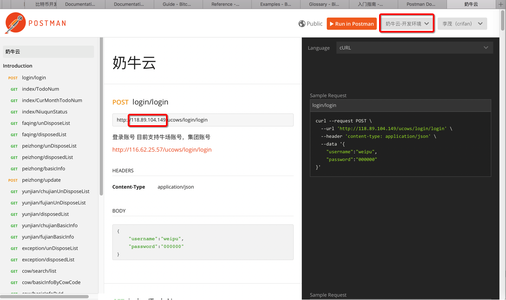

当然发布文档后，也可以实时切换环境：

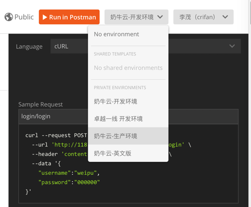

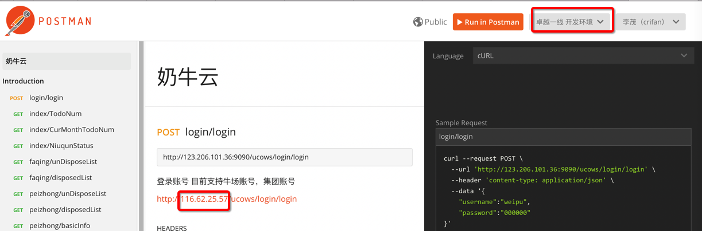

#### 环境变量的好处
当更换服务器时，直接修改变量的IP地址：

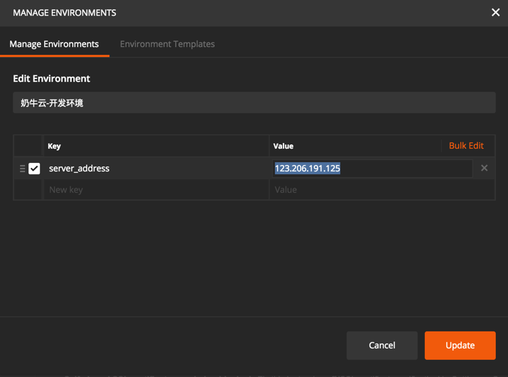

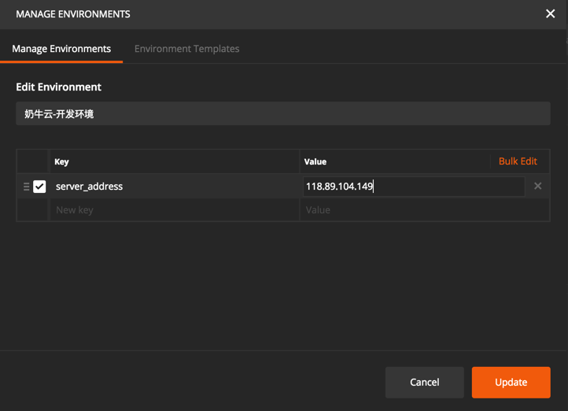

即可实时更新，当鼠标移动到变量上即可看到效果：

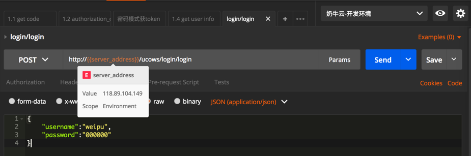

