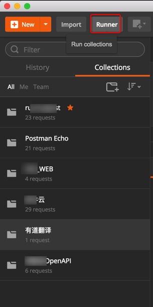

# 测试接口
选中某个分组后，点击Runner

选中某个分组后点击Run

即可看到测试结果：

-》好像是需要自己预先去添加test，然后才能测试的。

关于此功能的介绍可参考[Postman官网](https://www.getpostman.com/postman)的[git图](https://www.getpostman.com/img/v2/postman/gifs/collection-runner.gif)

> **[info] TODO**
> 
> 待后续有空继续完善此处Postman测试接口的内容。