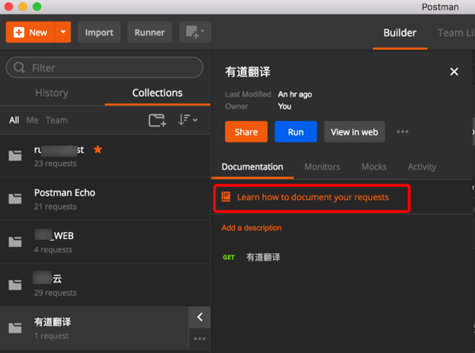
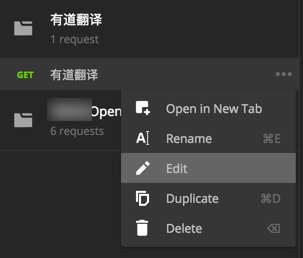
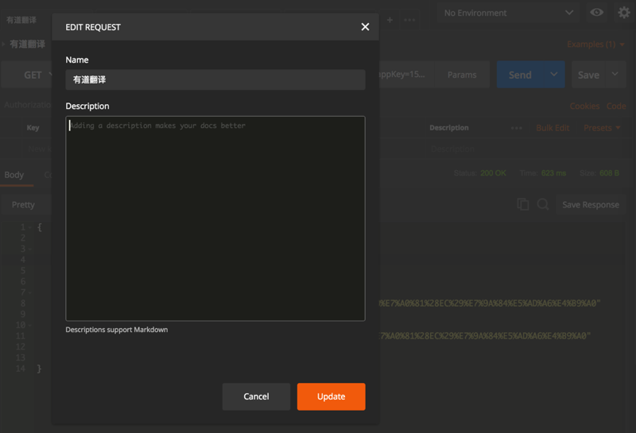
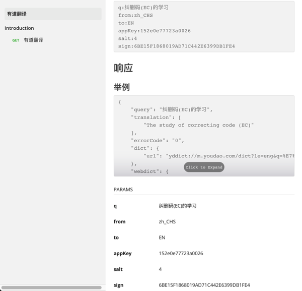

# 给接口添加描述

通过看到：

[Intro to API documentation](
https://www.getpostman.com/docs/postman/api_documentation/intro_to_api_documentation)

得知，API的描述中，也支持Markdown的。

所以，可以很方便的添加有条理的接口描述，尤其是参数解释了：

可以看到`Descriptions support Markdown`

而对于要解释的参数，可以通过之前的`Param -> Bulk Edit`的内容：

拷贝过来，再继续去编辑：

以及添加更多解释信息：

点击Update后，即可保存。

## 发布后带Markdown描述的API的效果

去发布后：

对应的效果：[有道翻译](https://documenter.getpostman.com/view/669382/collection/77fd4ek)

