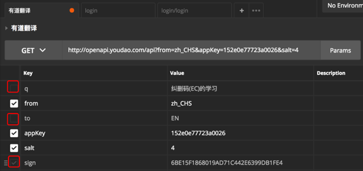
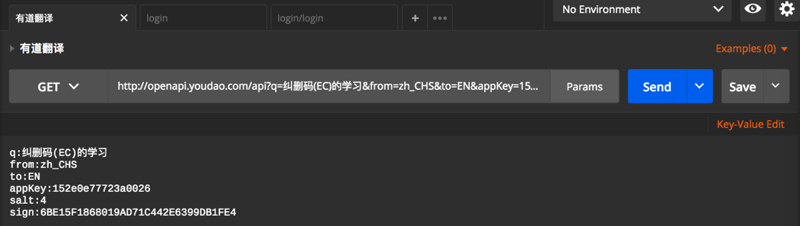

# GET的Request的多参数

在GET请求中有多个参数需要处理的时候，Postman中有很多方便的手段去操作：

## 自动解析多个参数Params

比如，对于一个GET的请求的url是：
`http://openapi.youdao.com/api?q=纠删码(EC)的学习&from=zh_CHS&to=EN&appKey=152e0e77723a0026&salt=4&sign=6BE15F1868019AD71C442E6399DB1FE4`

对应着其实是`?key=value`形式中包含多个Http的GET的query string=query parameters

Postman可以自动帮我们解析出对应参数，可以点击Params：

看到展开的多个参数：

如此就可以很方便的修改，增删对应的参数了。

## 不勾选某些参数达到临时禁用的效果
且还支持，在不删除某参数的情况下，如果想要暂时不传参数，可以方便的通过不勾选的方式去实现：

## 批量编辑GET的多个参数

当然，如果想要批量的编辑参数，可以点击右上角的**Bulk Edit**，去实现批量编辑。

