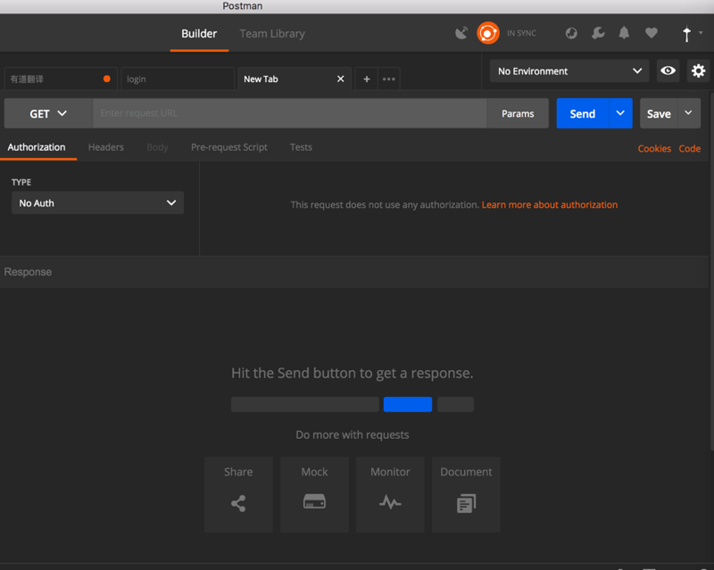
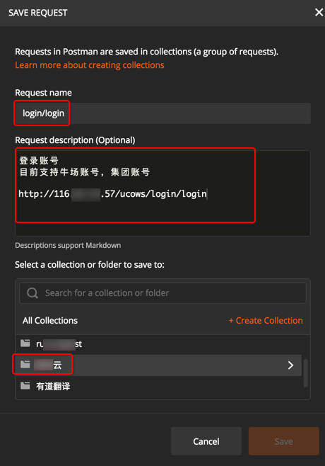

# 新建Request

去新建接口，即对应的**Request**：`New -> Request`

或，在右边的Tab页面中点击加号**+**：

即可看到新建的Tab页：

然后：
* 设置HTTP的Method方法和输入api的地址

* 设置相关头信息

* 设置相关GET或POST等的参数

都填写好之后，点击Send去发送**请求Request**：

即可看到返回的**响应Response**的信息了：

然后可以重复上述修改Request的参数，点击Send去发送请求的过程，以便调试到API接口正常工作为止。

待整个接口都调试完毕后，记得点击Save去保存接口信息：

去保存当前API接口，然后需要填写相关的接口信息：
* Request Name: 请求的名字
  * 我一般习惯用保存为 接口的最后的字段名，比如`http://{{server_address}}/ucows/login/login`中的`/login/login`
* Request Description: 接口的描述
  * `可选` 最好写上该接口的要实现的基本功能和相关注意事项
  * 支持Markdown语法
* Select a collection or folder to save: 选择要保存到哪个分组（或文件夹）
  * 往往保存到某个API接口到所属的该项目名的分组

填写好内容，选择好分组，再点击保存：

此时，Tab的右上角的黄色点（表示没有保存）消失了，表示已保存。

且对应的分组中可以看到对应的接口了：

> #### warning::默认不保存返回的Response数据
> * 直接点击Save去保存，只能保存API本身（的Request请求），不会保存Response的数据
> * 想要保存Response数据，需要用后面要介绍的 [多个Example](http://book.crifan.com/books/api_tool_postman/website/postman_func_resp/save_multi_example.html)
