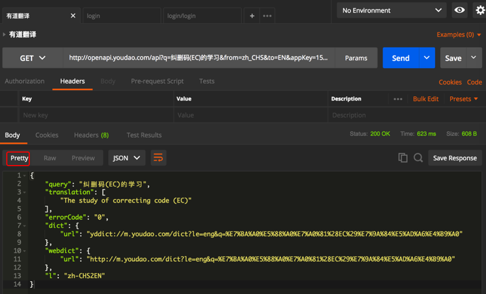
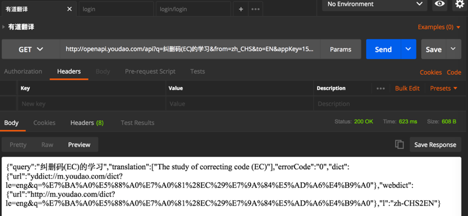

# Response数据显示模式

Postman对于返回的Response数据，支持三种显示模式：

## `默认`格式化后的Pretty模式

## Raw原始模式

点击**Raw**，可以查看到返回的没有格式化之前的原始数据：

## Preview预览模式

以及Preview，是对应Raw原始格式的预览模式：

Preview这种模式的显示效果，好像是对于返回的是html页面这类，才比较有效果。
