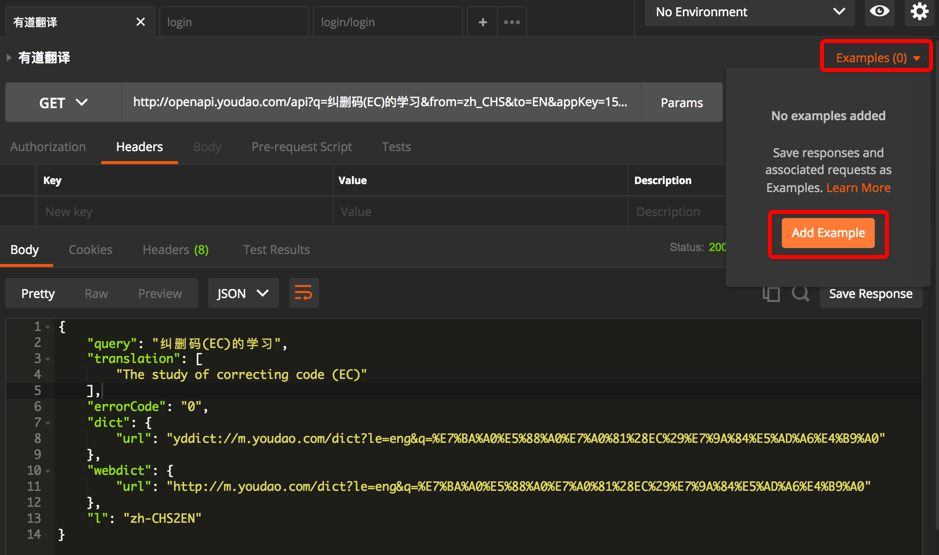
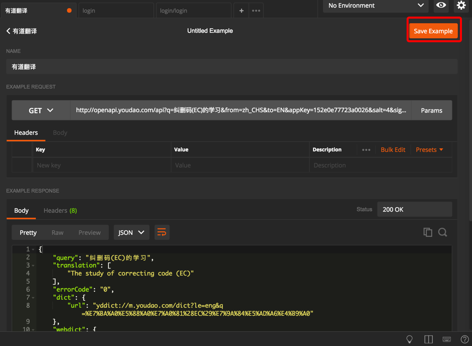
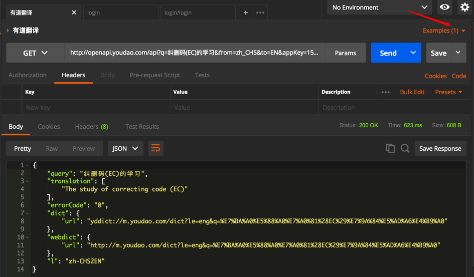
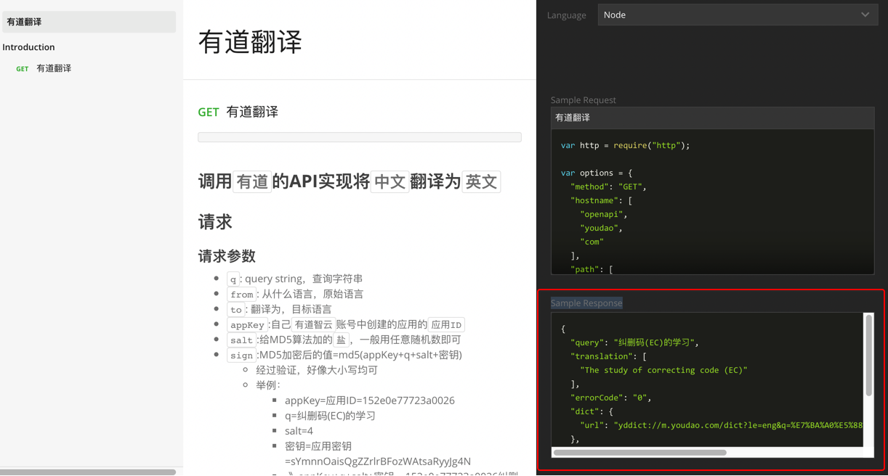
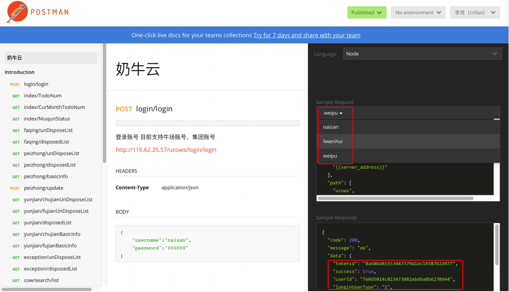
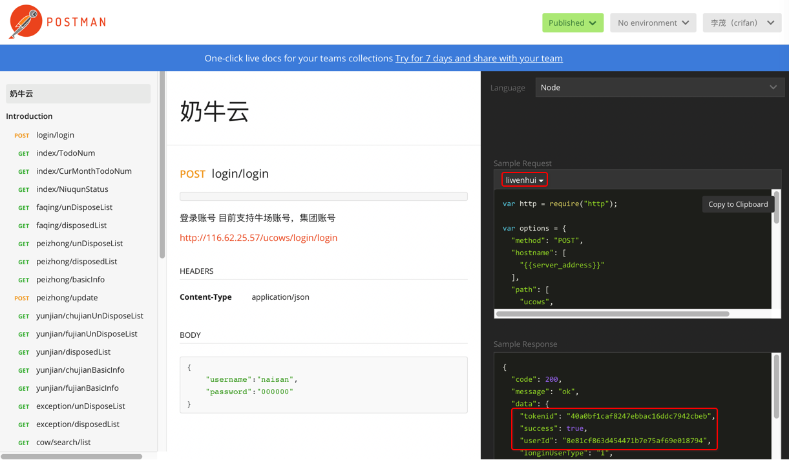

# 保存多个Example

之前想要实现，让导出的API文档中能看到接口返回的Response数据。后来发现是**Example**这个功能去实现此效果的。

## 如何添加Example

继续点击**Save Example**：

保存后，就能看到**Example(1)**了：

## 单个Example在导出的API文档中的效果
然后再去导出文档，导出文档中的确能看到返回数据的例子：

## 多个Example在导出的API文档中的效果

